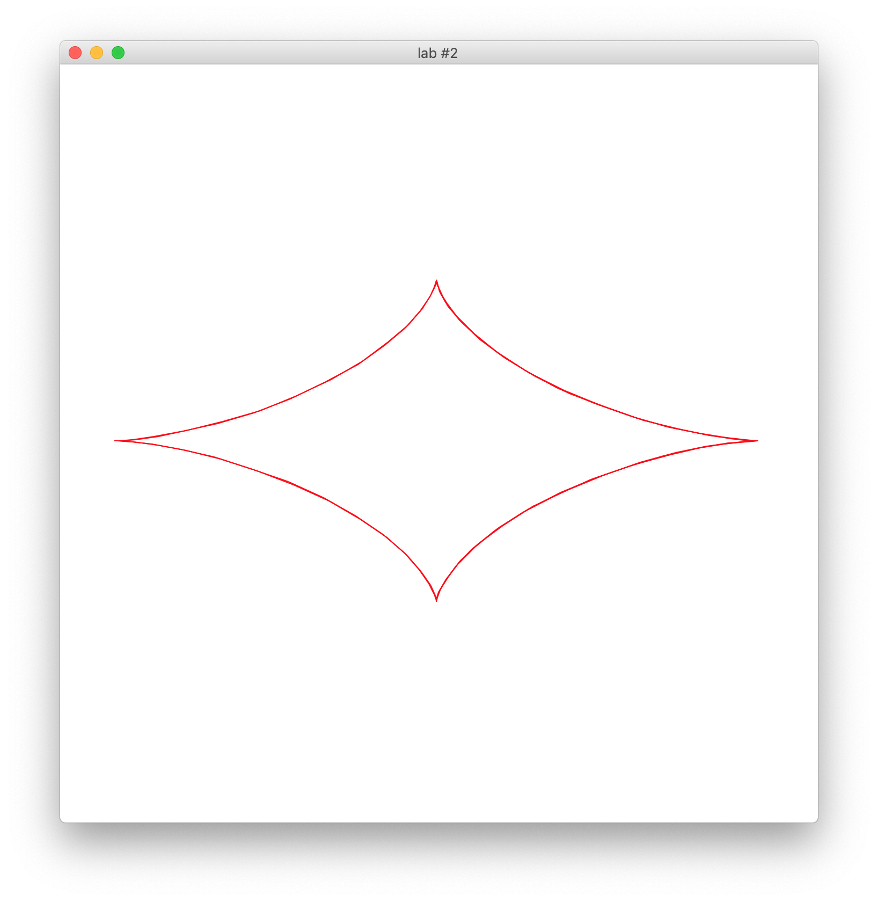
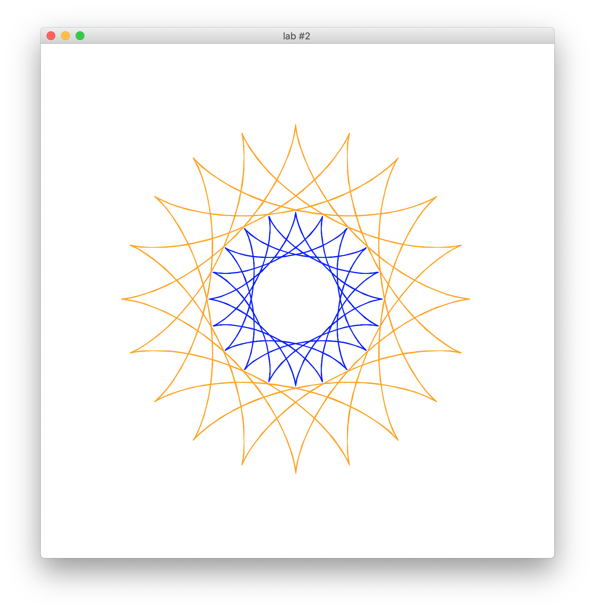
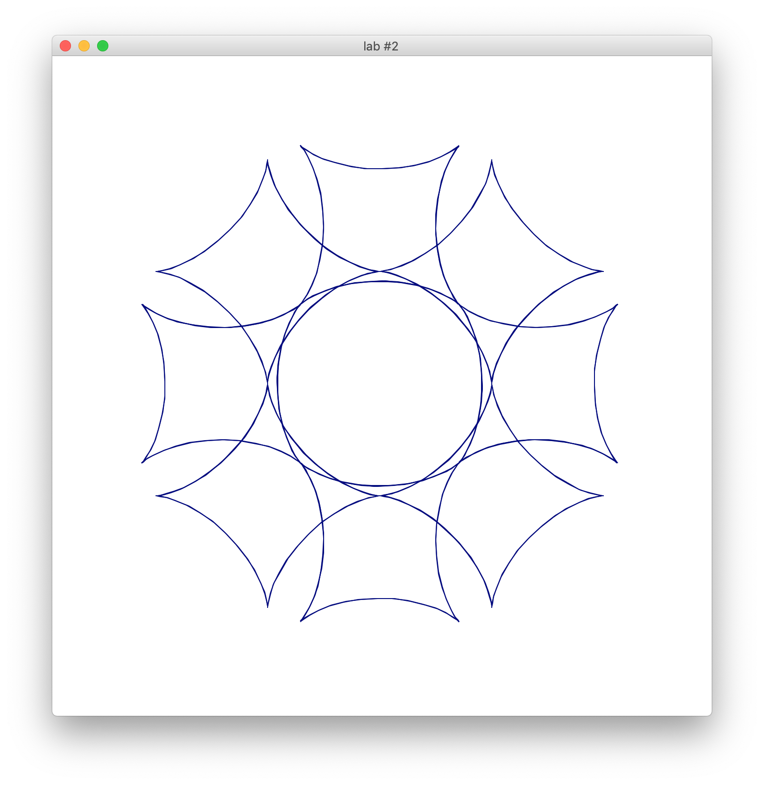
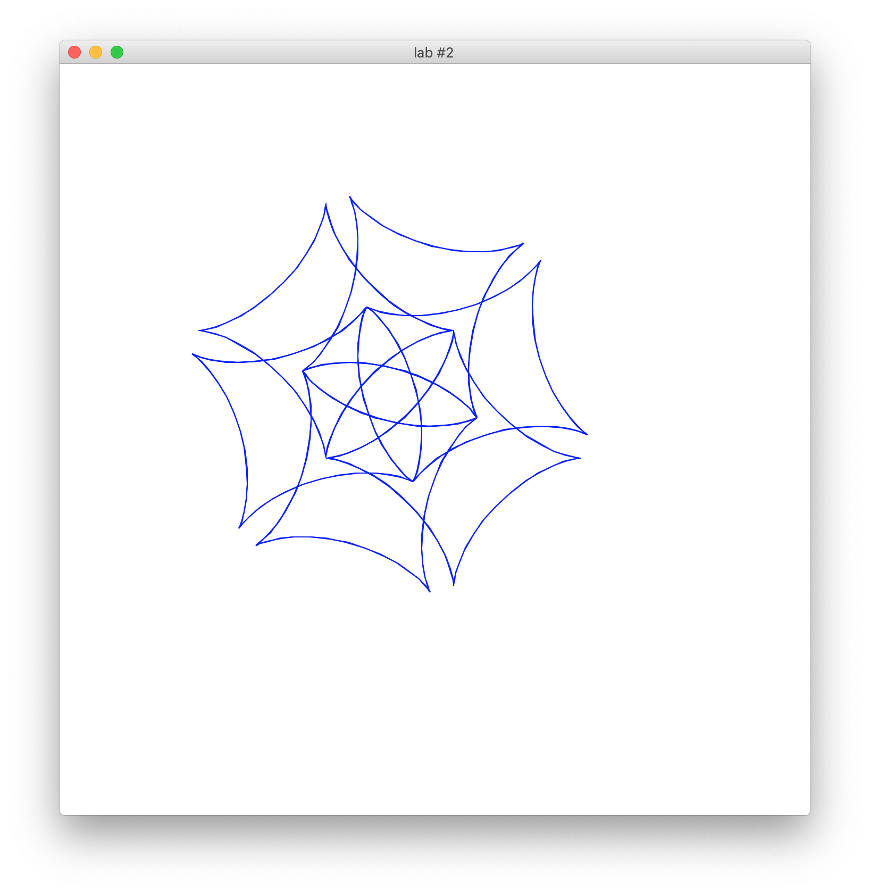
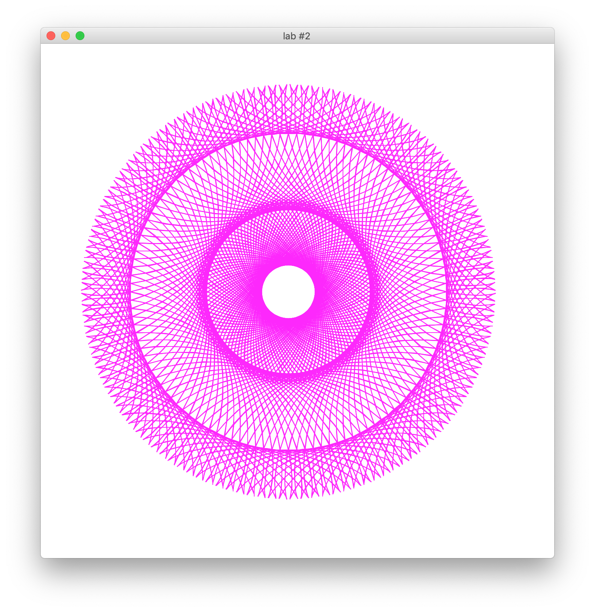

# Preview and Usage

Built different charts with figure according to params

Figure params:
```
sizeA            X coordinate size

sizeB            Y coordinate size

sizeR            whole sizr

centerPoint      (x, y) figure center
```

**Optional chart params:**
```
-h, --help  show this help message and exit

--n N            Initialize num for center rotation

--m M            Initialize num for corner rotation
```
**PreSets:**

- First:


- Second:


- Third:


- Fourth:


- Fifth:

